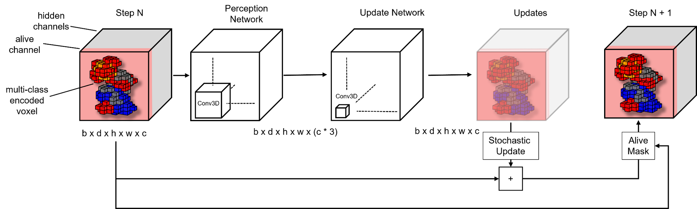

<!-- SHIEDS -->
<a id="readme-top"></a>
<div align="center">    

# Exploring the Applications of NCA in Molecular Sciences  

![PyPI - Python Version][python-shield]
[![Conference][conference-shield]][conference-url]
[![Conference][contributors-shield]][contributors-url]
[![Stargazers][stars-shield]][stars-url]
[![Unlicense License][license-shield]][license-url]

</div>

<!-- PROJECT LOGO -->
<br />
<div align="center">
  <a href="https://github.com/croningp/molnca">
    
  </a>

  <h3 align="center">Molecular NCA</h3>

  <p align="center">
    Neural Cellular Automata for molecular tasks
    <br />
    <a href="https://openreview.net/pdf?id=Il8mRcEiRq">Read Paper</a>
    ·
    <a href="https://github.com/croningp/molnca/issues/new?labels=bug&template=bug-report---.md">Report Bug</a>
  </p>
  </br></br>
</div>

<!-- TOC -->
## Table of Contents
<details>
  <summary>Expand</summary>
  <ol>
    <li>
      <a href="#about-the-project">About the project</a>
    </li>
    <li>
      <a href="#project-organization">Project Organization</a>
    </li>
    <li>
      <a href="#installation">Installation</a>
    </li>
    <li><a href="#experiments">Experiments</a></li>
    <li><a href="#usage">Usage</a></li>
    <li><a href="#contributors">Contributors</a></li>
    <li><a href="#license">License</a></li>
    <li><a href="#citing">Citing</a></li>
    <li><a href="#acknowledgments">Acknowledgments</a></li>
  </ol>
</details>
</br>

<!-- ABOUT THE PROJECT -->
## About The Project

This project adapts [Neural Cellular Automata](https://arxiv.org/abs/2103.08737) (NCA) for 3D molecular task from simply growing a molecule from a seed, to in protein-pocket interactor growth, partial protein-backbone reconstruction, and conditioned switching between molecular conformation. The NCAs are either trained on a voxel representation of the atoms in a given molecule, or their electron density decorated with the electrostatic potentail calcuated with [xtb](https://github.com/grimme-lab/xtb) and [orbkit](https://github.com/orbkit/orbkit).

<p align="right">(<a href="#readme-top">back to top</a>)</p>

## Project Organization

```
│
├── ncamol - Contains of code required to run the experiments
├── notebooks - Notebook for each experiment
├── configs - Configs for experiments
├── models - checkpoints and logs for the experiments
└── external_packpages - Contains a copy of Orbkit (https://github.com/orbkit/orbkit) with minor changes in the imports

```

<p align="right">(<a href="#readme-top">back to top</a>)</p>

<!-- Installation -->
## Installation
The easiest way to install the dependencies is using [uv](https://docs.astral.sh/uv/getting-started/installation/#standalone-installer). Once you have done so follow the steps below.
</br></br>

1. Clone the repo
```sh
git clone https://github.com/croningp/molnca.git
cd molnca
```

2. Install [xtb](https://xtb-docs.readthedocs.io/en/latest/setup.html) and set the XTB_PATH variable in the .env file to PATH_TO_XTB/bin/xtb
```.env
e.g.
XTB_PATH="/home/sebastian/pkgs/xtb-6.6.0/bin/xtb/"

optionally:
CPU_COUNT=... # for XTB
```

3. Install dependencies
```
uv venv --python 3.11
uv pip sync requirements.txt
```


<p align="right">(<a href="#readme-top">back to top</a>)</p>


<!-- Experiments -->
## Experiments

Each experiment can be recreated in a jupyter notebook:

```
│
└── notebooks
  ├── grow_molecule.ipynb - grow molecule from sinlge seed (atom_channel representation & ed/esp)
  ├── grow_inhibitor_in_pocket.ipynb - grow a molecule inside of a protein pocket/ protein surface
  ├── backbone_reconstruction.ipynb - regrow missing regions from a protein backbone
  └── cistrans_switching.ipynb - 'light-state' conditioned conformation switching 
```

<p align="right">(<a href="#readme-top">back to top</a>)</p>


<!-- USAGE EXAMPLES -->
## Usage

If you want to train a NCA on your own inputs the respective notebook should provide you with everything you need to do so. In case you encounter any problems, feel free to [reach out](mailto:pagel.sebastian.1@gmail.com?subject=[GitHub]).

<p align="right">(<a href="#readme-top">back to top</a>)</p>


## Contributors:

<a href="https://github.com/croningp/molnca/graphs/contributors">
  
</a>

<p align="right">(<a href="#readme-top">back to top</a>)</p>


<!-- LICENSE -->
## License

Distributed under the MIT License. See `LICENSE` for more information.

<p align="right">(<a href="#readme-top">back to top</a>)</p>


<!-- Citation -->
## Citing
```
@inproceedings{
pagel2023exploring,
title={Exploring the applications of Neural Cellular Automata in molecular sciences},
author={Sebastian Pagel and Leroy Cronin},
booktitle={NeurIPS 2023 AI for Science Workshop},
year={2023},
url={https://openreview.net/forum?id=Il8mRcEiRq}
}
```


<!-- ACKNOWLEDGMENTS -->
## Acknowledgments

README was adapted from this [template](https://github.com/othneildrew/Best-README-Template/blob/main/BLANK_README.md)


<!-- MARKDOWN LINKS & IMAGES -->
<!-- https://www.markdownguide.org/basic-syntax/#reference-style-links -->
[conference-shield]: https://img.shields.io/badge/NeurIPS_23-AI4Science-blue?style=for-the-badge
[conference-url]: https://openreview.net/pdf?id=Il8mRcEiRq
[contributors-shield]: https://img.shields.io/github/contributors/croningp/molnca.svg?style=for-the-badge
[contributors-url]: https://github.com/croningp/molca/graphs/contributors
[stars-shield]: https://img.shields.io/github/stars/croningp/molnca.svg?style=for-the-badge
[stars-url]: https://github.com/croningp/molca/stargazers
[python-shield]: https://img.shields.io/badge/python-3.11-3670A0?style=for-the-badge&logo=python&logoColor=ffdd54
[license-shield]: https://img.shields.io/badge/license-MIT-blue?style=for-the-badge
[license-url]: https://github.com/othneildrew/Best-README-Template/blob/master/LICENSE.txt

